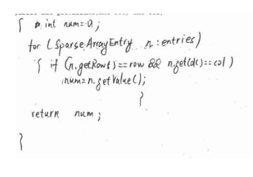

|[Study](.)| [Tickets](Tickets) | [TechTalks](TechTalks)| [Solutions](../Solutions)| [TPT](TPT)|[SolutionNotes](SolutionNotes)|

#### About
```java 
I am Varnit. I am taking CSA, and my teacher is the great John Mortensen. 
I am part of team AntiSquirrelTaskForce.
```
```java 
Pages Tutorial
"Tickets" lead to the grading of my projects sorted week by week
"TechTalks" will display my notes from the tech talks
"Solutions" Will include my repl.it links and tangibles for my code
"TPT" will show my plan and progress for AP exam studying
"Solution%20Notes" will show code snippets and notes from my code
```
Study plan -
```java 
 
- Week of March 7th: Review Unit 1+2 content. Do practice MC and FRQ, and place the link to the completed work here


- Week of March 14th: Review Unit 3+4 content. Do practice MC and FRQ, and place the link to the completed work here


- Week of March 21th: Review Unit 5 content. Do practice MC and FRQ, and place the link to the completed work here


- Week of March 28th: Review Unit 6 content. Do practice MC and FRQ, and place the link to the completed work here


- Week of April 4th: Review Unit 7 content. Do practice MC and FRQ, and place the link to the completed work here


- Week of April 11th: Review Unit 8 content. Do practice MC and FRQ, and place the link to the completed work here


- Week of April 18th: Review Unit 9 content. Do practice MC and FRQ, and place the link to the completed work here


- Week of April 25th: Review Unit 10 content. Do practice MC and FRQ, and place the link to the completed work here

  - in depth - 
 
    - Monday - practice MCQ test
    - Tuesday - practice frq test
    - Wednesday - review practice mcq test
    - Thursday - review practice frq test
    - Friday - upload frq in repl for review
    - saturday - mock ap exam
    The AP CSA Free Response Questions
You've finished the multiple-choice section of the exam, and after a short break, it's time for the second half of the test: the FRQ section. The FRQ section has 4 different FRQs in 90 minutes, the same amount of time as the multiple-choice portion.
Types of FRQs
The AP CSA test has 4 FRQs, each of which is different in style. Here's a little bit about them:
Methods and Control Structures
This FRQ asks you to write methods and master control structures such as loops and branching (if/else if/else).
Class Writing
This FRQ asks you to write an entire class, given specifications of what the class should do, and including any variables and methods the class should include.
Array/ArrayList
This FRQ asks you to write methods that use an array or ArrayList, including filtering and traversal. In recent years, the questions tend to be more about ArrayLists than standard arrays.
2D Arrays
This FRQ asks you to write methods that use a 2D array, including traversal of arrays.
AP CSA FRQ Task Verbs
Assume: Suppose that the statement is true without any further information. For example, in later parts of a question, we can assume that the code written in earlier parts works as intended.
Complete (program code): Sometimes, there is code that is partially filled. It is your job to finish the code so that it works as intended.
Implement/Write: When doing this, we write a whole class or method, given what it is supposed to do.
FRQ Tips
Here are some tips that you should follow to ace the AP CSA FRQs.
Skip Parts You Don't Know
For all the multi-part questions on the FRQ, the later parts always state to refer to a past method that you have coded in an earlier part. Even though you may not know how to code this earlier method, you can still answer this question because you can assume that prior code works. This will prevent you from losing points twice because the earlier method is incorrect, thus preventing double jeopardy. It saves a lot of time and you can jump back to the earlier part if you have time left!
Write Pseudocode Before Starting to Write the Final Solution
Before jumping to the actual question, write pseudocode as a multi-line comment so you can plan what you are going to do and what is needed for the code. It will also keep you from missing necessary components and keeps your future code organized when finally answering the question and writing real Java code.
Make Up Some Test Cases
If you are unsure of whether your solution is correct, make up some test cases and test the code that you have written on these different test cases. If you get the expected result for all the test cases, then your code is most likely correct. If not, then go back to the point where the code did not work as expected and see how you can correct it.

```


MCQ results and corrections -

```java 
Score - 31/39

Corrections:

number -5 :answer=A  why--- Answer A is the correct answer because Y will not be evaluated based of the code. This leaves X as the only output.

number -8 :answer=B  why--- {1, 6, 3, 4} will be printed. This is because the index 1 is printed, index 2+4 and the rest will be printed aswell.

number -11 :answer=E  why--- It will print K+2, which is n, then n +1 2 times which is 0. Then it will print K+2 again. This will result in "noon"

number -14 :answer=C  why--- If and b are the same values, then it will most likely go to the else statement. In the else statement nothoing is returned or printed.

number -19 :answer=E  why--- Nothing will be printed for I,II, and III. This will not print anything because they will cause a compiling error.

number -23 :answer=C  why--- {3, 4, 5, 2, 1}. For this problem I had used proccess of elimination. The other options had errors in the first or second index, but I did not catch the rror for answer b. After looking back at it it was a silly error, and the answer is evidently c.

number -37 :answer=E  why---  I had initially chosen that both II and III were correct, but after looking at it III will not run. This is because K will not be returned.

number -38 :answer=C  why---  Returns the number of elements in numbers that are equal to val is the correct answer. This isebcause after the methodd will be run, Var will equal the results.

```

FRQ repl and images - 
 

repl:https://replit.com/@VarnitGupta/Frqs#Main.java

images:





