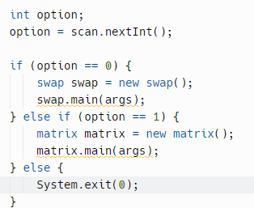
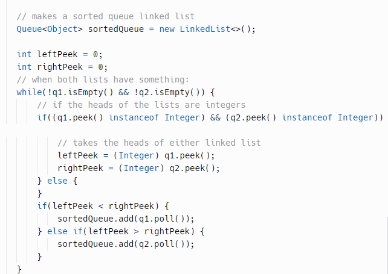
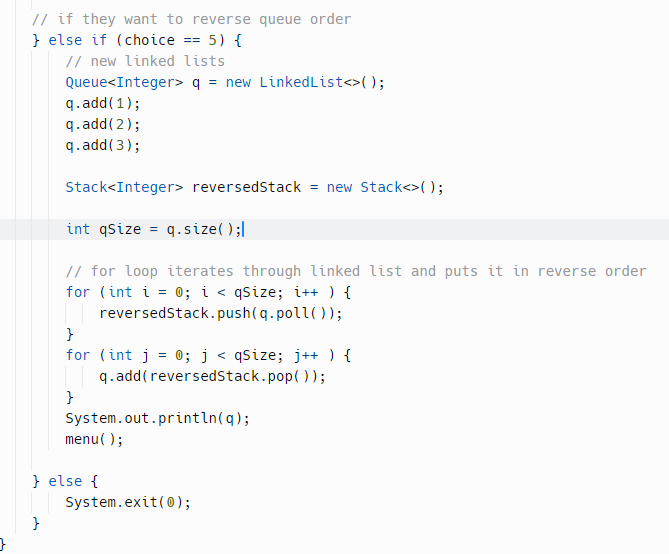
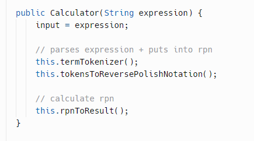
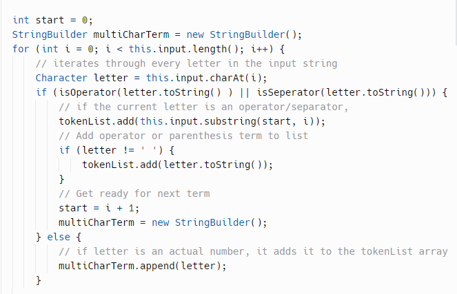
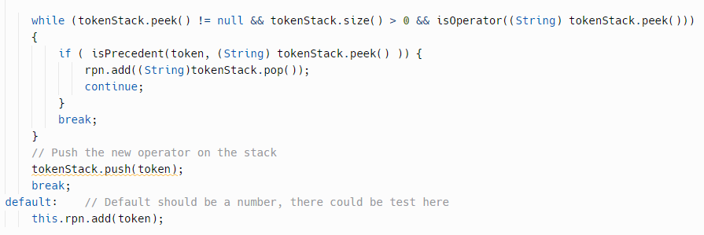

|[Home](../Home)| [Tickets](../Tickets) | [TechTalks](../TechTalks)| [Solutions](../Solutions)| [TPT](../TPT)|[SolutionNotes](.)|
#Week0:
#Code Snippets That Highlight Learning:

#Week1:
#Code Snippets That Highlight Learning:

#Week2:
#Code Snippets That Highlight Learning:

#Sorts:
#Sort implementations and the Big O complexity of these Sorts(25%):
--
Big O Complexity definition: Used to describe the complexity of an algorithm when measuring its efficiency, which in this case means how well the algorithm scales with the size of the dataset.
- BubbleSort: Bubble sort relies on multiple swaps instead of a single like selection sort. The algorithm continues to go through the array repeatedly, swapping elements that are not in their correct location.
- MergeSort: It uses the divide and conquers strategy for sorting elements in an array. It is also a stable sort, meaning that it will not change the order of the original elements in an array concerning each other. The underlying strategy breaks up the array into multiple smaller segments till segments of only two elements (or one element) are obtained. Now, elements in these segments are sorted and the segments are merged to form larger segments.
- InsertionSort: In insertion sort, one picks up an element and considers it to be the key. If the key is smaller than its predecessor, it is shifted to its correct location in the array.
- SelectionSort: In selection sort, two loops are used. The inner loop one picks the minimum element from the array and shifts it to its correct index indicated by the outer loop. In every run of the outer loop, one element is shifted to its correct location in the array. It is a very popular sorting algorithm in python as well.
  - Time Complexity	of Sorts
 

    Selection Sort	Ω(n^2)	θ(n^2)	O(n^2)	 
    Bubble Sort	Ω(n)	θ(n^2)	O(n^2)	 
    Insertion Sort	Ω(n)	θ(n^2)	O(n^2)	 
    Heap Sort	Ω(n log(n))	θ(n log(n))	O(n log(n))	 
    Quick Sort	Ω(n log(n))	θ(n log(n))	O(n^2)	 
    Merge Sort	Ω(n log(n))	θ(n log(n))	O(n log(n))
# Analysis (25%).
    considering Data Structure loading, Comparisons, Swaps, Big O complexity, and Time, I conclude that the best sort is Merge Sort
Why?

- Merge sort is better for large data structures: Mergesort is a stable sort, unlike BubbleSort and InsertionSort, and can be easily adapted to operate on linked lists and very large lists stored on slow-to-access media such as disk storage or network attached storage.

- Mergesort is a stable sort, unlike quicksort and heapsort, and can be easily adapted to operate on linked lists and very large lists stored on slow-to-access media such as disk storage or network attached storage.